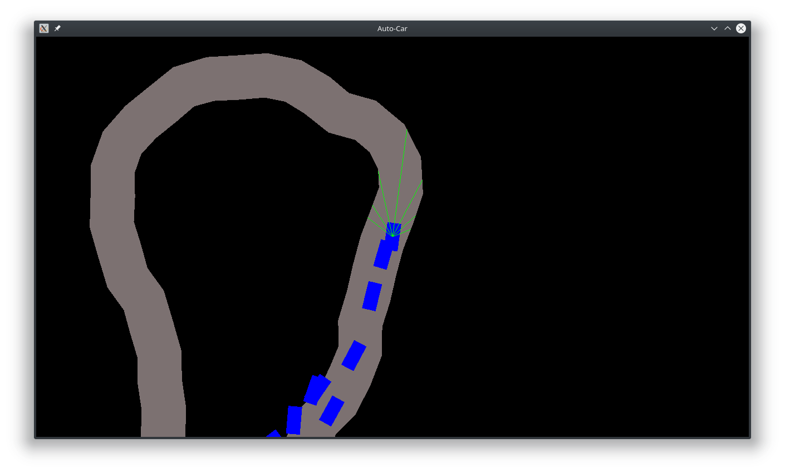

# Auto-Car
Genetic algorithm learns to drive cars on randomly generated track  
Agents are one layer neural networks with random weights  
From each generation best agents are taken and from their weigths new agents are created  
In ~100 generations they manage to drive faster than human with arrows  

Press SPACE to go to the next generation  

Whole thing could be coded prettier (e.g. training on separate threads, ray tracing gets buggy sometimes), but this was just a quick weekend project

 

### Running
Requires SFML installed (apt install sfml-dev on ubuntu)  
Then `make` to build and `./main` to run  

